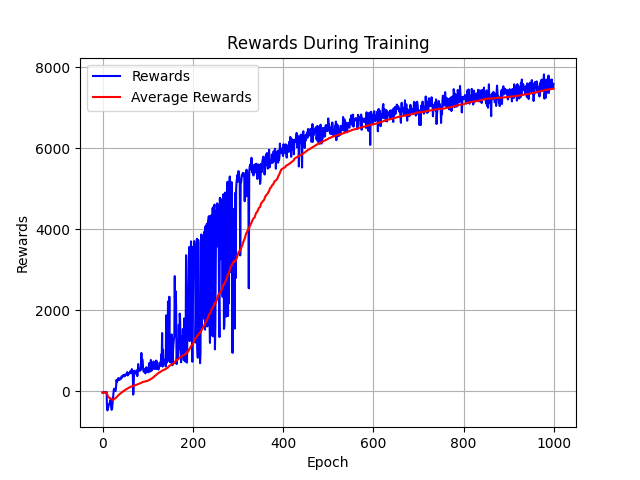

# TD3 Implementation for Continuous Control

This project provides a PyTorch implementation of the Twin Delayed Deep Deterministic Policy Gradient (TD3) algorithm. The implementation is designed to solve continuous control tasks from the [Gymnasium](https://gymnasium.farama.org/) library.

## Features
-   **TD3 Algorithm:** A clean and straightforward implementation of TD3 for continuous action spaces.
-   **Customizable Networks:** Easily define actor and critic network architectures.
-   **Hyperparameter Management:** All hyperparameters are managed through YAML configuration files for easy experimentation.
-   **Experiment Tracking:** Automatically saves training results, including reward/loss graphs and the best-performing model weights.

## Project Structure
```
.
├── Architecture.py             # Defines Actor and Critic network classes
├── TD3.py                      # Main script for training the TD3 agent
├── requirements.txt            # Python dependencies
├── hyperparametersFormat.yml   # Template for hyperparameter configuration
├── Pendulum/                   # Example directory for the Pendulum-v1 environment
│   ├── hyperparameters.yml
│   ├── Pendulum.pt
│   └── ... (graphs and results)
└── HalfCheetah/                # Example directory for the HalfCheetah-v4 environment
    ├── hyperparameters.yml
    ├── HalfCheetah.pt
    └── ... (graphs and results)
```

## Getting Started

### Prerequisites
-   Python 3.8+
-   [MuJoCo](https://mujoco.org/getting_started/index.html) (for environments like HalfCheetah)

### Installation
1.  **Clone the repository:**
    ```bash
    git clone <your-repo-url>
    cd <your-repo-name>
    ```

2.  **Create a virtual environment (recommended):**
    ```bash
    python -m venv myenv
    source myenv/bin/activate
    ```

3.  **Install the dependencies:**
    ```bash
    pip install -r requirements.txt
    ```

## Usage
To start training an agent, run the `TD3.py` script and provide the path to a hyperparameter configuration file.

1.  **Configure Hyperparameters:**
    Create a new directory for your environment (e.g., `MyEnv/`). Inside, create a `hyperparameters.yml` file. You can use `hyperparametersFormat.yml` as a template.

2.  **Run Training:**
    Execute the main script with your configuration file:
    ```bash
    python TD3.py MyEnv/hyperparameters.yml
    ```
    For example, to run the included Pendulum environment configuration:
    ```bash
    python TD3.py Pendulum/hyperparameters.yml
    ```

The script will begin training the agent. Progress will be printed to the console, and upon completion, the following files will be saved in your environment directory (e.g., `MyEnv/`):
-   `MyEnv.pt`: The weights of the best-performing actor model.
-   `MyEnvRewardsGraph.png`: A plot of rewards per epoch.
-   `MyEnvLossGraph.png`: A plot of actor and critic losses over training steps.

## Results
Here is an example of the rewards graph generated after training on the `HalfCheetah-v4` environment.


